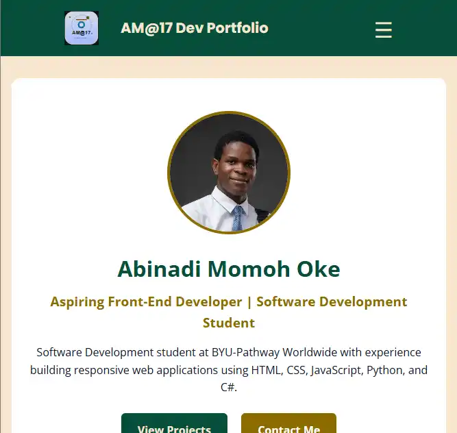

# Abinadi Momoh Oke — Developer Portfolio



## About

This repository contains my personal developer portfolio, built to showcase my web development and software development projects, technical skills, education, and professional growth.

The portfolio is built with **HTML, CSS, JavaScript, and JSON** and is hosted with GitHub Pages.

**Live Portfolio:** https://amomoh6392.github.io/portfolio/

## What I Built

The portfolio includes:

* Responsive navigation
* Home, About, Projects, Contact, and Resume pages
* Dynamically generated project cards
* Project filtering by development category
* Technology tags for each project
* GitHub and live-demo links
* Contact form
* Responsive layouts for different screen sizes

## How the Project Works

Project information is stored in `data/projects.json`. Each project contains information such as its title, description, technologies, category, image, and links.

The `scripts/projects.mjs` file uses JavaScript `fetch()` to load the JSON data and dynamically creates the project cards. When a visitor selects a category, JavaScript filters the loaded project array and renders only the matching projects.

This keeps the project data separate from the HTML and makes adding or updating projects easier.

## Featured Projects

### Chamber Directory

A responsive chamber directory that displays local business members dynamically from JSON data. The directory includes different membership levels, responsive layouts, and a grid/list view for browsing members.

**Debugging challenge:** The chamber member cards didn't appear even though the data was in the JSON file. Using the browser's developer tools and console, I traced the problem to how my JavaScript loaded the data. I fixed it so the data loads before the cards are created. Now when something doesn't display, I check the console and verify the data first instead of assuming the problem is in the HTML or CSS.


[Live Demo](https://amomoh6392.github.io/wdd231/chamber/directory.html) · [Source Code](https://github.com/amomoh6392/wdd231/tree/main/chamber)

### Study in Germany

An informational website designed to help students explore universities, scholarships, and study opportunities in Germany.

**Challenge:** I had to organize a large amount of information into a structure that remained easy to navigate while adapting to different screen sizes.

[Live Demo](https://amomoh6392.github.io/wdd131/project) · [Source Code](https://github.com/amomoh6392/wdd131/tree/main/project)

### Predictive Maintenance

A C# application for managing predictive maintenance information using object-oriented programming.

**Challenge:** I had to organize the application around objects and their responsibilities instead of keeping all of the program logic together. This helped me practice designing classes that work together to represent the problem being solved.

[Source Code](https://github.com/amomoh6392/Am17Cse210/tree/main/project)

## Technologies

* HTML5
* CSS3
* JavaScript
* JSON
* Git
* GitHub
* GitHub Pages

## What I Learned

One of the biggest lessons from building this portfolio was learning to separate **data from presentation**. Instead of manually creating every project card, I stored the project information in JSON and wrote JavaScript to load, filter, and render that information.

I also learned that building a portfolio is more than making a page look good. I had to think about how the files work together, how users interact with the site, how the project data is maintained, and how the finished site is deployed.

## Running the Project Locally

Clone the repository:

```bash
git clone https://github.com/amomoh6392/portfolio.git
```

Move into the project directory:

```bash
cd portfolio
```

Open the project in Visual Studio Code and use **Live Server** or another local web server.

A local server is recommended because the project loads `data/projects.json` using JavaScript `fetch()`.

## Connect With Me

* **LinkedIn:** https://linkedin.com/in/abinadi-momoh-204575205
* **GitHub:** https://github.com/amomoh6392
* **Portfolio:** https://amomoh6392.github.io/portfolio/
